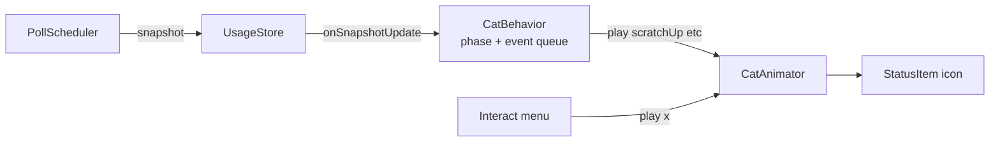

# Activity-driven cat behavior

## Overview

Replace the random 20-second auto-pick inside the animator with a phase
machine driven by poll deltas. Each 5-minute poll window picks one of three
phases — `plain` (initial / day rollover), `active` (today's spend went up),
or `resting` (today's spend unchanged) — and pre-schedules ~5 random
animation events inside that window.

The animator becomes passive: it only plays what the behavior tells it to.

## Architecture



Clean split:

- `CatBehavior` (new) owns the phase machine and the event schedule.
- `CatAnimator` becomes passive: no more random self-triggering.
- `PollScheduler` / `UsageStore` stay as they are.

## Phase rule

On every poll, compare previous `todaySpend` (cents) to the new one:

- First snapshot ever, or `new < old` (day rollover) → phase `plain` for
  this window. Plain breathing only, no events.
- `new > old` → phase `active` for this window.
- `new == old` → phase `resting` for this window.

Hard state locks (`.sleeping` for logged-out, `.tired` / `.error` for
error) continue to bypass everything — behavior pauses scheduling while a
lock is held.

## Event scheduling

At the start of each non-plain phase:

1. Pre-pick 5 random offsets in `[0, pollInterval)` and sort them into a
   queue of fire times.
2. A 1 Hz `Timer` inside `CatBehavior` pops events at their scheduled time
   and calls `animator.play(pickFromPool())`.

Pre-scheduling (vs a per-tick random roll) prevents clumping and keeps the
average near one event per minute across the window.

Pools:

- `active` → `[.scratchUp, .scratchDown, .scratchHead, .runAround]`
- `resting` → `[.yawn, .sleepBrief]`

A new snapshot arriving mid-window cancels any remaining queued events and
re-plans the next window fresh.

## Animator changes

File: [Sources/Cursorcat/UI/CatAnimator.swift](../../Sources/Cursorcat/UI/CatAnimator.swift)

- Delete the random auto-pick from `tick()`:

```swift
if animation == nil, idleTime > 10, Int.random(in: 0..<200) == 0 { ... }
```

Animator becomes a pure consumer — `play(_:)` runs one-shots, `tick()`
just keeps breathing between them.

- Extend `CatAnimation`:
  - `.scratchUp`, `.scratchDown`, `.scratchHead` (replaces the generic
    `.scratching`, which aliases to `.scratchHead`).
  - `.yawn` — composite timeline in `advance()`: 5 ticks tired → 20 ticks
    idle → 5 tired → 20 idle → 5 tired → done. ~5.5 s total, reads as
    three yawns (blink-style, since oneko only has one tired frame).
  - `.sleepBrief` — same visuals as `.sleeping` but capped at 600 ticks
    (60 s). Reuses `sleepTiredTicks` and `sleepFrameHoldTicks`.
  - `.runAround` unchanged.
  - `.alert` remains menu-only.
- Keep the existing `.sleeping` (1 h cap) exclusively for the hard state
  lock when logged-out.

## Renderer changes

File: [Sources/Cursorcat/UI/CatRenderer.swift](../../Sources/Cursorcat/UI/CatRenderer.swift)

Add cells for the two new scratch directions. The exact grid coordinates
in the bundled `oneko.gif` differ across forks, so these canonical
oneko.js coords are a starting point — eyeball the first build and adjust
if needed:

```swift
static let scratchWallN = [(0, 0), (1, 0)]  // paws reaching up
static let scratchWallS = [(3, 3), (4, 3)]  // paws on floor
static let scratchHead  = scratchSelf       // alias for 3-frame self-scratch
```

If a sprite lands wrong on first build, add a one-off debug helper that
dumps every (col, row) 32x32 cell as a PNG to `dist/`, pick the right
coords once, remove the helper.

## New file

`Sources/Cursorcat/State/CatBehavior.swift`

Skeleton (dependencies already in place — `UsageStore` is an
`ObservableObject` with `@Published var snapshot`):

```swift
@MainActor
final class CatBehavior {
    private let animator: CatAnimator
    private let store: UsageStore
    private let pollWindow: TimeInterval = 300
    private let eventsPerWindow = 5

    private var previousToday: Int?
    private var phaseDeadline: Date = .distantPast
    private var queue: [Date] = []
    private var pool: [CatAnimation] = []
    private var ticker: Timer?
    private var cancellable: AnyCancellable?

    func start()
    func stop()
    private func onSnapshot(_ s: UsageSnapshot)
    private func tick()
}
```

Subscribe to `store.$snapshot` to react to polls. A 1 Hz `Timer` is enough
since events are coarse.

## Wiring

File: [Sources/Cursorcat/UI/StatusItemController.swift](../../Sources/Cursorcat/UI/StatusItemController.swift)

Instantiate `CatBehavior` alongside the animator, start it after
`animator.start()`, and stop it alongside. Menu-driven `play(_:)` calls
remain untouched and still cleanly interrupt whatever behavior scheduled.

## Menu

Leave the Interact submenu as-is (Scratch / Sleep / Alert / Run around)
for manual triggering. Automatic behavior now covers day-to-day.

## Edge cases

- App launch: first poll seeds `previousToday`; the initial window is
  `plain` (pure breathing).
- Logged-out or error: behavior clears its queue and stops scheduling
  until the lock releases.
- System wake: `PollScheduler` already debounces wake and triggers a
  fresh poll; behavior just reacts to the resulting snapshot.
- Manual menu trigger during a scheduled window: menu's `play(_:)` wins;
  queued events keep their own times and may fire afterwards, which is
  fine.

## Implementation todos

- [ ] `cells` — Add `scratchWallN` and `scratchWallS` to
  `CatRenderer.Cell`; verify sprite alignment on first build (dump probe
  PNGs if wrong).
- [ ] `animator-strip` — Strip random auto-pick from
  `CatAnimator.tick()`; add `.scratchUp`, `.scratchDown`, `.scratchHead`,
  `.yawn`, `.sleepBrief` cases and timelines.
- [ ] `behavior` — Create
  `Sources/Cursorcat/State/CatBehavior.swift`: subscribe to
  `UsageStore.$snapshot`, compute phase, pre-schedule 5 random events per
  window, pop from queue at 1 Hz.
- [ ] `wiring` — Wire `CatBehavior` into `StatusItemController` start /
  stop lifecycle.
- [ ] `verify` — Build, run, confirm: first window is plain breathing;
  simulated activity triggers active pool; no change triggers resting
  pool.
